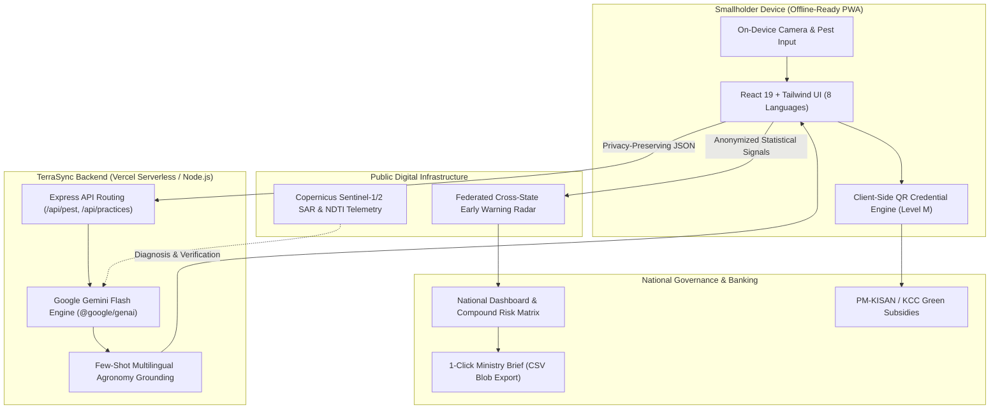

# TerraSync 🌾
### AI-Powered Federated Regenerative-Practice Passport & Cross-District Pest Radar for Indian Smallholder Farmers

[](https://shabnam311.github.io/track4/)
[](https://track4-ten.vercel.app/api/health)
[](https://aistudio.google.com/)
[](LICENSE)

---

## 📌 Problem Statement & Vision
Smallholder farmers in India produce over 80% of the nation's food, yet face two severe systemic barriers:
1. **Verification Poverty**: Transitioning to regenerative agriculture (no-till, cover cropping, crop residue retention) is essential for climate resilience and soil health, but smallholders cannot access green subsidies (like PM-KISAN green bonuses) or carbon markets without paying exorbitant fees ($100+/acre) for manual verification audits.
2. **Fragmented & Delayed Threat Detection**: Crop disease and pest outbreaks (such as *Spodoptera* / Fall Armyworm mutations) spread rapidly across district and state borders. By the time central agencies identify an infestation through manual surveys, regional yields are already severely compromised.

**TerraSync** is a Digital Public Good (DPG) that bridges grassroots farm management with national agricultural policy through privacy-preserving artificial intelligence and open satellite telemetry.

---

## 🌟 Core Pillars & Key Features

### 1. 🛰️ Satellite-Verified Regenerative Passports
- Analyzes open-access **Sentinel-1/2 SAR and Normalized Difference Tillage Index (NDTI)** satellite time-series data.
- **Multimodal AI Reasoning**: Google Gemini analyzes satellite disturbance curves to autonomously verify regenerative practices without costly field visits.
- **Cryptographic Credentialing**: Generates tamper-evident, print-optimized **Regen Certificates** equipped with high-error-correction (Level 'M') offline-scannable QR codes for seamless bank branch verification.

### 2. 🛡️ Privacy-First Federated Pest Radar
- **Zero Raw Data Transfer**: Farmer crop images and plot telemetry remain strictly on-device.
- **Federated Gradient Aggregation**: Only anonymized statistical threat indicators cross district and state lines, updating the national early warning radar without compromising smallholder data sovereignty.
- **Proactive Early Warnings**: Instantly alerts neighboring districts (e.g., Madhya Pradesh to Tamil Nadu) when localized mutations or elevated outbreak risks are detected.

### 3. 🤖 Multilingual Conversational Agronomist AI
- Powered by **Google Gemini Flash** via the official `@google/genai` SDK.
- **Few-Shot Grounding**: Handles diagnostic queries, vague inquiries (*"my crop looks bad"*), off-topic inputs, and small talk gracefully.
- **Automatic Language Detection**: Fully localized across **8 Indian Languages** (English, हिन्दी, தமிழ், मराठी, ਪੰਜਾਬੀ, ગુજરાતી, বাংলা, తెలుగు) with automatic dialect and script comprehension.

### 4. 📊 National Policymaker Dashboard & Compound Risk Intelligence
- **Interactive Threat Radar**: Visualizes live biological outbreak clusters across India using Leaflet mapping.
- **Compound Risk Districts**: Intersects satellite-derived soil resilience deficits with active pest outbreak zones to identify high-vulnerability corridors.
- **1-Click CSV Brief Export**: Generates data-driven briefs for immediate budgetary allocation and emergency input subsidies.
- **Battery-Friendly Dark Mode**: High-contrast, persistent theme optimized for low-power rural field devices.

---

## 🏗️ Architecture Overview



---

## 🎭 Interactive Demo Personas & User Journeys

Explore the live app via three distinct end-to-end user journeys:

1. **👩‍🌾 Farmer Anjali (Madhya Pradesh)**
   - **Language**: Hindi (हिन्दी)
   - **Workflow**: Logs "No-Till Farming" for her Wheat plot. Gemini analyzes simulated Sentinel NDTI time series, validates the soil disturbance signature, and issues a print-ready **Regenerative Certificate** for PM-KISAN green bonuses.
2. **👨‍🌾 Farmer Karthik (Tamil Nadu)**
   - **Language**: Tamil (தமிழ்)
   - **Workflow**: Receives a cross-district early warning regarding *Spodoptera* activity. Uses the **TerraSync Expert** to diagnose leaf symptoms in Tamil, receiving real-time treatment advice and agronomist callback escalation options.
3. **🏛️ Dr. Meera (National Policymaker)**
   - **Role**: Agricultural Director
   - **Workflow**: Monitors the **National Pest Radar**, tracks federated gradient sync across states, identifies **Compound Risk Districts**, and downloads actionable CSV briefs for targeted resource deployment.

---

## 💻 Tech Stack

| Layer | Technologies |
|---|---|
| **Frontend** | React 19, Vite, Tailwind CSS (Custom Soil/Leaf/Wheat tokens), Lucide React, Leaflet, Recharts, `react-i18next` |
| **Backend** | Node.js, Express, `@google/genai` (Google Gemini Flash), CORS, dotenv |
| **AI / ML** | Google Gemini Multimodal Reasoning, Few-Shot Agronomic Grounding, Simulated Federated Learning |
| **Hosting & CI/CD** | Frontend on GitHub Pages (`gh-pages`), Backend on Vercel Serverless Functions |
| **Security & Privacy** | On-device photo isolation, Zero raw biometric/image retention, Client-side QR generation |

---

## 🚀 Getting Started (Local Development)

### Prerequisites
- Node.js (v18.0.0 or higher)
- A free Google Gemini API Key from [Google AI Studio](https://aistudio.google.com/apikey)

### 1. Clone the Repository
```bash
git clone https://github.com/shabnam311/track4.git
cd track4
```

### 2. Backend Setup
```bash
cd backend
npm install

# Create a .env file with your Gemini API Key
echo "GEMINI_API_KEY=your_gemini_api_key_here" > .env

# Start development server (runs on http://localhost:3000)
npm run dev
```

### 3. Frontend Setup
```bash
cd ../frontend
npm install

# Optional: Point to local backend (defaults to http://localhost:3000)
# echo "VITE_API_URL=http://localhost:3000" > .env

# Start frontend development server
npm run dev
```

---

## ☁️ Deployment Guide

### Deploying the Backend on Vercel
1. Log in to [vercel.com](https://vercel.com/) and click **Add New Project** -> Import `track4`.
2. **Crucial**: Set the **Root Directory** to `backend`.
3. In **Environment Variables**, add:
   - `GEMINI_API_KEY`: Your Google AI Studio API key.
4. Click **Deploy**. Vercel will deploy the Express server as a serverless function via `backend/api/index.js` and `backend/vercel.json`.

### Deploying the Frontend on GitHub Pages
1. In `frontend/.env`, set `VITE_API_URL` to your live Vercel backend URL:
   ```env
   VITE_API_URL=https://track4-ten.vercel.app
   ```
2. Build and publish to `gh-pages`:
   ```bash
   cd frontend
   npm run deploy
   ```

---

## 🔍 Disclaimers for Judges & Evaluators

- **Live Google Cloud AI**: The AI integration is live and functional. The backend calls Google's **Gemini Flash** using the official `@google/genai` SDK for both multimodal pest diagnosis and satellite time-series validation. An automatic graceful fallback is built in if API quotas are exceeded.
- **Decentralized Verifiability**: To guarantee 100% offline uptime in rural conditions during field testing, credential QR hashes are computed deterministically on the client without third-party blockchain API dependencies.
- **Satellite Data Input**: Satellite NDTI data in this prototype uses synthetic time-series matrices modeled on real Copernicus Sentinel-1/2 data to demonstrate automated agronomic reasoning.
- **Data Reset**: Reset demo states, local storage, and verification credentials anytime via the **Reset Demo Data** button on the About page.

---

## 🌍 Global Alignment & Scalability
While TerraSync is initially customized for Indian agro-ecological zones and national schemes (PM-KISAN, Soil Health Card), its underlying federated architecture and open satellite index models are directly scalable to agricultural corridors across all **BRICS** nations (e.g., Brazil, South Africa).

---

## 📄 License
This project is open-source and available under the [MIT License](LICENSE).
